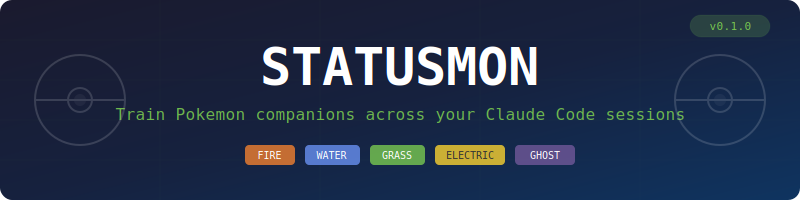

<p align="center">
  
</p>

<p align="center">
  <strong>Gotta train 'em all.</strong>
</p>

<p align="center">
  <a href="https://www.npmjs.com/package/statusmon"></a>
  <a href="https://github.com/josheche/statusmon/blob/main/LICENSE"></a>
  <a href="https://nodejs.org"></a>
  <a href="https://github.com/josheche/statusmon"></a>
</p>

<p align="center">
  <a href="https://github.com/josheche/statusmon">GitHub</a>
</p>

---

A Pokemon companion lives in your Claude Code statusline. Every coding session earns XP. Your Pokemon levels up, evolves at the real game levels, and when fully evolved — a new wild encounter appears. Full-color ANSI sprite art rendered directly in your terminal.

**Code more → earn XP → level up → evolve → catch 'em all.** Gen 1 Kanto (151 Pokemon). Pokedex tracking. Type-colored UI. Zero config beyond install.

```
 🌿 TANGROWTH LV36 · #465 · Vine Pokemon · Gen 1
 ━━━━━━━━━━━━━━━━━━━━━━━━━━━━━━━━──────────────

      ▄██▄▄ ▄  ▄▄
    ▄ █▀██▀██▀█▀██▀▄
   ▀██▀ ▀▄██▀██▀█▀██▄
    █▀▄██▀▄██▄██▀ █▄▀█▀
     ▀█▀██▀▄▄▀█▄▀▄█▀█
      ▀ ▄█▄██▀█▀▀▀ █▄
       ▀██▀█▀▀ ▀██▀▀
       ▀▄▄▀▀    ▀█▀▀▀▄
                  ▀▀▀▀
```

---

## Quick Start

**Claude Code Plugin** (recommended)

```bash
claude plugin marketplace add josheche/statusmon
claude plugin install statusmon@statusmon
```

**Manual setup**

```bash
git clone https://github.com/josheche/statusmon.git
cd statusmon && npm install && npm run build
```

Add to `~/.claude/settings.json`:

```json
{
  "statusLine": {
    "type": "command",
    "command": "/path/to/statusmon/scripts/statusline-wrapper.sh"
  }
}
```

That's it. Open Claude Code — your starter Pokemon appears. Code normally. Watch it grow.

---

## How It Works

Every Claude Code session generates tokens. Statusmon converts those tokens into XP:

```
session_xp  = floor(total_tokens / 10,000)
total_xp    = banked_xp + session_xp
level       = floor(total_xp / 3) + 1
```

XP banks automatically between sessions. Your Pokemon's level persists and grows over time. The XP bar shows progress toward the next level.

| Session size | Tokens | XP earned | Levels |
|-------------|--------|-----------|--------|
| Light | ~50K | 5 | ~2 |
| Normal | ~100K | 10 | ~3 |
| Heavy | ~200K | 20 | ~7 |

**Evolution** happens at the real game levels from PokeAPI — Charmander evolves at Lv.16, Charmeleon at Lv.36. When your Pokemon evolves, a full-color ANSI sprite announcement appears.

**Release** happens after your Pokemon is fully evolved and hits Lv.60 (or Lv.30 for non-evolving Pokemon). A new wild encounter appears — a fresh companion for your next journey.

---

## Generations

Start with **Gen 1 Kanto** — the original 151 Pokemon. Unlock new generations by training:

| Gen | Pokemon | Unlock |
|-----|---------|--------|
| 🔴 Gen 1 | #001–#151 Kanto | Start |
| 🔵 Gen 2 | #001–#251 Johto | 50 sessions |
| 🟡 Gen 3 | #001–#386 Hoenn | 100 sessions |
| 🟢 Gen 4 | #001–#493 Sinnoh | 150 sessions |
| ... | ... | +50 each |

Unlocking adds to the encounter pool — you can still find Gen 1 Pokemon after unlocking Gen 2.

---

## Sprites

Full-color ANSI sprites rendered with bilinear interpolation using Unicode half-block characters (`▀▄`). Every Pokemon has a unique sprite pulled from PokeAPI.

Configurable size via `sprite_size` in `~/.statusmon/trainer.json`:

| Size | Terminal rows | Fidelity |
|------|--------------|----------|
| `16` | 8 rows | Compact |
| `32` | 16 rows | Default |
| `48` | 24 rows | Detailed |
| `64` | 32 rows | Large |
| `96` | 48 rows | Full resolution |

---

## Type Colors

The UI uses game-accurate type colors from the Pokemon games:

| Type | Color | Type | Color |
|------|-------|------|-------|
| 🔥 Fire | `rgb(240, 128, 48)` | 💧 Water | `rgb(104, 144, 240)` |
| 🌿 Grass | `rgb(120, 200, 80)` | ⚡ Electric | `rgb(248, 208, 48)` |
| 🔮 Psychic | `rgb(248, 88, 136)` | 👻 Ghost | `rgb(112, 88, 152)` |
| 🐉 Dragon | `rgb(112, 56, 248)` | 🌑 Dark | `rgb(112, 88, 72)` |
| ⚙️ Steel | `rgb(184, 184, 208)` | 🧚 Fairy | `rgb(238, 153, 172)` |

Name, XP bar, and accents are tinted with your Pokemon's primary type color.

---

## Pokedex

Every Pokemon you train is recorded in `~/.statusmon/pokedex.json`. Use the `/pokedex` slash command to browse your history — original species, final evolution reached, max level, dates trained.

```bash
# In Claude Code
/pokedex
```

---

## Commands

| Command | What |
|---------|------|
| `/pokemon` | Show your current companion's status and stats |
| `/pokedex` | Browse all Pokemon you've encountered and trained |

---

## State

All data lives in `~/.statusmon/`:

```
~/.statusmon/
├── trainer.json       # Current companion + XP + generation
├── pokedex.json       # All encountered Pokemon history
└── cache/             # Cached PokeAPI responses + sprites
```

No database, no native deps, no compilation. Pure Node.js + [pngjs](https://github.com/pngjs/pngjs) + [pokedex-promise-v2](https://github.com/PokeAPI/pokedex-promise-v2).

---

## Works With

Statusmon chains with other statusline plugins. If [TokenGolf](https://github.com/josheche/tokengolf) is installed, both render together — your Pokemon companion above TokenGolf's efficiency HUD.

---

## Architecture

```
statusline.mjs     → Reads trainer.json, computes level from session tokens,
                     renders sprite + info. Nearly pure render — writes only
                     when tokens grow by 10K+.

session-start.mjs  → Banks previous session's XP, checks generation unlocks,
                     pre-caches PokeAPI data. Runs once per session.

lib/evolution.mjs  → Evolution chains, level computation, release logic.
                     Uses pokedex-promise-v2 for PokeAPI access.

lib/sprite.mjs     → PNG → ANSI half-block art conversion with bilinear
                     interpolation. Configurable size.

lib/trainer.mjs    → State management for ~/.statusmon/trainer.json.
lib/pokedex.mjs    → Pokedex recording on Pokemon release.
lib/cache.mjs      → Sprite PNG download + filesystem cache.
```

---

<p align="center">
  <sub>Built with 🔥 by <a href="https://github.com/josheche">@josheche</a> · Powered by <a href="https://pokeapi.co/">PokeAPI</a></sub>
</p>
